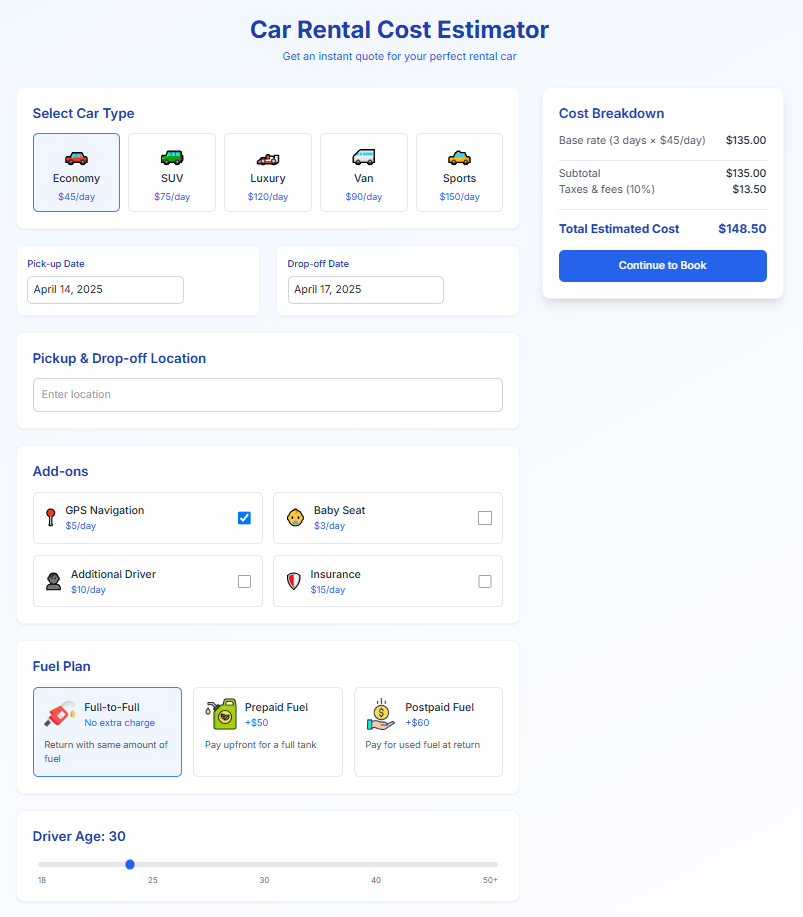

# 🚗 Car Rental Cost Estimator

A clean, modern calculator for estimating car rental costs. Pick dates, locations, and vehicle types to see instant price estimates—built with Next.js, TypeScript, and TailwindCSS for a fast, smooth experience. Ideal for developers as well as travelers! 🚗



Live Demo: [car-rental-cost-estimator.vercel.app](https://car-rental-cost-estimator.vercel.app/)

---

## ✨ Features

- 📅 Date Picker: Intuitive rental period selection
- 💰 Real-Time Estimates: Instant price breakdowns
- 🎨 Animations: Delightful UI transitions (Framer Motion)
- 📱 Fully Responsive: Works flawlessly on all devices

---

## 🚀 Tech Stack

- **Framework:** [Next.js](https://nextjs.org/)
- **Language:** [TypeScript](https://www.typescriptlang.org/)
- **Styling:** [Tailwind CSS](https://tailwindcss.com/)
- **Animations:** [Framer Motion](https://www.framer.com/)
- **Deployment:** [Vercel](https://vercel.com/)

---

## 📦 Installation

```bash
git clone https://github.com/Alirazahaider/car-rental-cost-estimator
```

```bash
cd car-rental-calculator
```

```bash
npm install
```

```bash
npm run dev
```

## 💌 Get In Touch

Thank you for checking out this project! If you have any questions, suggestions, would like to collaborate, or need my development services:

[](mailto:alicodespace@gmail.com)
[](https://www.linkedin.com/in/alirazaweb)
[](https://alicodez.vercel.app/)

⭐ Support the project by starring the repository!
[](https://github.com/Alirazahaider/car-rental-cost-estimator)
